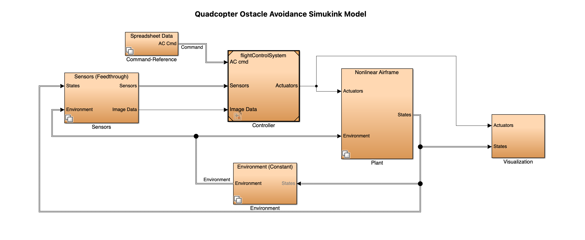

# MPC-Style-SCP-for-Quadrotor-Obstacle-Avoidance and Controller Design

**Model Predictive Control (MPC) Style Sequential Convex Programming (SCP) for Quadrotor Obstacle Avoidance**

In this project, our aim is to create a robust Sequential Convex Programming (SCP) code for quadrotor obstacle avoidance. SCP works by creating convex subproblems from a non-convex problem—in our case, 3D quadrotor obstacle avoidance. This is achieved by linearizing the non-convexities and approximating them into convex subproblems, which are then solved iteratively within a trust region.

You can find codes for the Obstalce Avoidance SCP algorithm:

[KutayDemiralay_Quadrotor Obstacle Avoidance SCP.ipynb](./KutayDemiralay_Quadrotor_Obstacle_Avoidance.ipynb)

### Performance of SCP Code Without Wind

Below is how the SCP code performs without wind:

**Figure 1:** As you can see, the node violation score is 0.0, meaning none of the nodes violate the obstacles in the route.

### Performance of SCP Code With Wind

However, when we add a constant wind force that the algorithm's dynamics are not aware of, the wind drags the drone off course, causing it to hit obstacles and drift away from our desired trajectory.

**Figure 2:** As you can see, the node violation score is around 41.72, meaning some of the nodes violate the obstacles in the route.

### Future Work: Adding an MPC-Style Approach

To overcome this, we will be adding an MPC-style approach to the SCP code. In this approach, the remaining trajectory will be recalculated at each node, which we hope will make our algorithm more robust against disturbances such as wind. This is currently planned as future work.

### Simulink Controller Design

An autonomous vehicle system has two key components: the first involves finding the optimal trajectory, and the second is designing a controller to ensure the vehicle follows that trajectory.

For this project, I designed a controller based on the principles outlined in "Quadcopter Modeling and Simulation Based on Parrot Minidrone." I simplified and adapted the model, tuned the PID controllers and other control parameters, and tailored the design to my specific quadcopter case. By integrating the commands from my SCP (Sequential Convex Programming) algorithm (same commands from Figure 1) , I developed a controller that effectively follows the optimized trajectory while accounting for the specific needs of my quadcopter.

The entire system was simulated using Simulink 3D Animation for visualization.

You can find the Simulink Model for the Quadcopter Obstalce Avoidance :

[QuadcopterObstacleAvoidanceSimulinkModel.slx](./QuadcopterObstacleAvoidanceSimulinkModel.slx)

**Figure 3:** . Simulink Main Block Diagram for Obstacle Avoidance Quadcopter Design

**Figure 4:** . "Simulink Controller 3D Animation GIF (Same Scenario as Figure 1)
