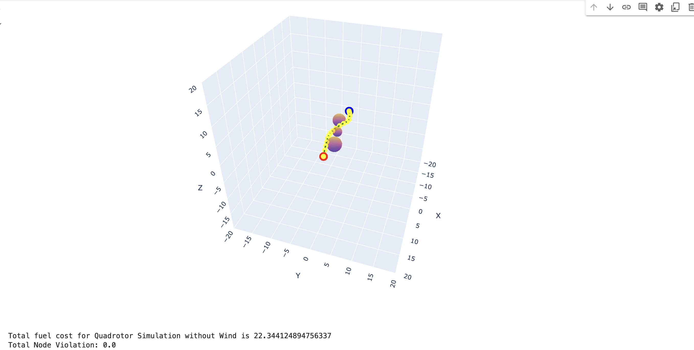
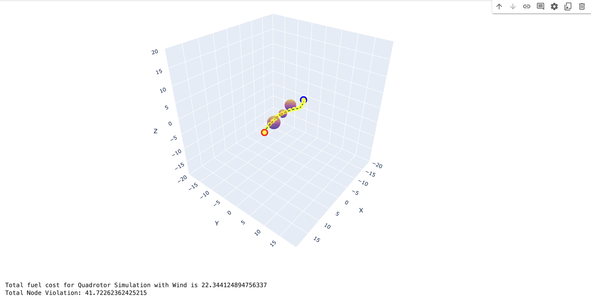

# MPC-Style-SCP-for-Quadrotor-Obstacle-Avoidance

**Model Predictive Control (MPC) Style Sequential Convex Programming (SCP) for Quadrotor Obstacle Avoidance**

In this project, our aim is to create a robust Sequential Convex Programming (SCP) code for quadrotor obstacle avoidance. SCP works by creating convex subproblems from a non-convex problem—in our case, 3D quadrotor obstacle avoidance. This is achieved by linearizing the non-convexities and approximating them into convex subproblems, which are then solved iteratively within a trust region.

You can find codes for the Obstalce Avoidance SCP algorithm:

[KutayDemiralay_Quadrotor Obstacle Avoidance SCP.ipynb](./KutayDemiralay_Quadrotor_Obstacle_Avoidance.ipynb)

### Performance of SCP Code Without Wind

Below is how the SCP code performs without wind:

**Figure 1:** As you can see, the node violation score is 0.0, meaning none of the nodes violate the obstacles in the route.

### Performance of SCP Code With Wind

However, when we add a constant wind force that the algorithm's dynamics are not aware of, the wind drags the drone off course, causing it to hit obstacles and drift away from our desired trajectory.

### Future Work: Adding an MPC-Style Approach

To overcome this, we will be adding an MPC-style approach to the SCP code. In this approach, the remaining trajectory will be recalculated at each node, which we hope will make our algorithm more robust against disturbances such as wind. This is currently planned as future work.

[Download TrajOptVideo.mp4](images/TrajOptVideo.mp4)

